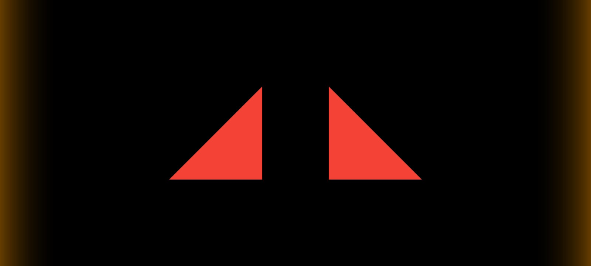
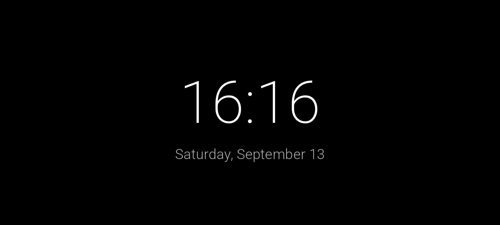

# PodPal Companion Display (PodFace)

This Flutter application is the "face" of the PodPal AI Planter System. It functions as an ambient, at-a-glance companion display, designed to provide an intuitive and emotional connection to your plant's well-being.

Instead of showing raw numbers, it uses a custom-animated vector face to display the plant's current state, such as happy, thirsty, sleeping, or hot.

**Note:** This application is not a standalone product. It is a component of the main PodPal project and requires the PodPal hardware to function.

### Main Project Repository
The complete PodPal project, including the main dashboard app and all hardware firmware, can be found here:
**[https://github.com/darkscript-dev/PodPal](https://github.com/darkscript-dev/PodPal)** 

<table>
  <tr>
    <td></td>
    <td></td>
  </tr>
  <tr>
    <td></td>
    <td></td>
  </tr>
</table>

## Features

*   **Real-time Emotional State:** Connects to the PodPal hardware over the local network to receive live sensor data.
*   **Fluid Custom Animation:** Utilizes Flutter's `CustomPainter` to draw and smoothly animate a vector face that transitions between various emotional states.
*   **Intelligent State Logic:** A priority-based system determines the most important state to show. For example, a critical alert like "Thirsty" will always override a passive state like "Happy."
*   **Kiosk-Friendly Design:** Built for dedicated displays (like a tablet) with a clean, full-screen interface.

## Getting Started

1.  **Clone the repository:**
    ```bash
    git clone [your-podface-repo-url]
    ```
2.  **Navigate to the project directory:**
    ```bash
    cd podface-repo-name
    ```
3.  **Install dependencies:**
    ```bash
    flutter pub get
    ```
4.  **Run the app:**
    ```bash
    flutter run
    ```
    To connect, you will need the PodPal hardware running on your local network.

## License

Distributed under the MIT License. See `LICENSE` for more information.